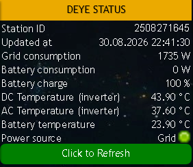

# Deye Inverter Status — Rainmeter Skin

A Rainmeter skin that shows live status of a Deye solar inverter/battery system on the Windows desktop — grid power, battery power and charge, DC/AC and battery temperatures, and current power source (grid vs. battery).

Data comes from the [Deye Cloud](https://www.deyecloud.com/) API via a small Python client; Rainmeter periodically runs the Python script and parses its output.



## How it works

The Python side is not a long-running service — it's a one-shot script that logs in, fetches the latest device snapshot, prints `key: value` lines to stdout, and exits.

1. **Rainmeter** (`RunCommand` plugin) runs `.venv\Scripts\python.exe main.py` on a timer (every ~6 minutes) and on skin refresh, capturing stdout into a text file (`DataFile`).
2. **`main.py`** authenticates via `handlers/ApiClient.py` (caching the bearer token in `token.json`), calls `worker.py`'s `Worker.work()`, and prints the results.
3. **`worker.py`** fetches the device snapshot and derives a `Source` field (`BATTERY` if grid draw is zero, otherwise `Grid`).
4. **The skin's `MeasureFile`** (`WebParser`) re-reads that text file with a single multi-group regex and feeds the individual `Meter`s.

The skin lives in `rainmeter_plugin/DeyeStatusEng.ini` (English labels; the earlier Russian `DeyeStatus2.ini` has been retired). Look and feel is driven by the `[Variables]` block — `#fontName#`, `#FontSize#`, `#AntiAlias#`, and the colour variables.

Current output contract — these lines, in this order, are what the skin's regex expects:

```
Station_id: 2508271645
Updated at: 05.06.2026 16:28:48
TotalGridPower: 1565 W
SOC: 100 %
DC Temperature: 44.80 °C
AC Temperature: 38.30 °C
Temperature- Battery: 22.30 °C
InverterOutputPowerL1L2: 0 W
Source: Grid
```

Only one of `TotalGridPower` / `InverterOutputPowerL1L2` is non-zero at a time: when the grid is drawing power the inverter output is reported as `0 W`, and `Source` is set accordingly.

## Requirements

- Windows
- [Rainmeter](https://www.rainmeter.net/)
- Python 3.12+ (`main.py` uses nested f-string quotes); the pinned venv here is CPython 3.13. It must live in a `.venv` at the project root — that's what the skin's `app_path` points at
- The `requests` package (no `requirements.txt` yet — install directly, see below)
- A Deye Cloud **developer** account: `APP_ID` / `APP_SECRET`, plus the login email/password for the account that owns the inverter

## Setup

1. **Create the virtualenv** at the project root (the skin hardcodes this path):
   ```powershell
   python -m venv .venv
   .venv\Scripts\pip install requests
   ```
2. **Create `config_local.ini`** (gitignored — not tracked in the repo) next to `main.py`:
   ```ini
   [settings]
   DEBUG=0
   BASE_URL=https://eu1-developer.deyecloud.com/v1.0
   EMAIL=your-deyecloud-email@example.com
   PASSW=your-deyecloud-password
   APP_ID=your-app-id
   APP_SECRET=your-app-secret
   ```
3. **Set the station ID.** It's currently hardcoded as the default argument of `Worker.work(station=...)` in `worker.py` — change it to your own station ID.
4. **Test the Python side on its own:**
   ```powershell
   .venv\Scripts\python.exe main.py
   ```
   This should print the nine `key: value` lines shown above and write to `app.log`.
5. **Install the skin.** Copy (or symlink) the contents of `rainmeter_plugin/` — `DeyeStatusEng.ini` and `@Resources/` — into your Rainmeter `Skins\DeyeStatus\` folder.
6. **Point the skin at this project.** In the `.ini`'s `[Variables]` section, set:
   - `app_path` to this project's absolute path
   - `DataFile` to wherever you want the polled output written (see note on `T:` below)
7. **Load the skin** in Rainmeter (right-click tray icon → Manage, or drag `DeyeStatusEng.ini` in).

## Project structure

```
main.py                 entry point: logging setup, auth, prints results
worker.py                fetches device snapshot, derives Source (Grid/Battery)
app_init.py              loads config_local.ini into `conf`
handlers/ApiClient.py    Deye Cloud API client (token cache, retries)
handlers/Configs.py      generic ini-backed config loader
config_local.ini         credentials & settings (gitignored)
token.json               cached bearer token (created on first run)
rainmeter_plugin/        skin source — mirrors the deployed skin
  DeyeStatusEng.ini      the skin itself (UTF-16 LE with BOM)
  @Resources/            bullet_green.png / bullet_red.png (power-source indicator)
  out.txt                captured stdout sample, handy as an offline DataFile
demo/                    sample output + screenshot, reference only
app.log, app.log.*       rotating logs (100 KB × 10 backups, gitignored)
```

## Known limitations / gotchas

- **Deye's API only refreshes every ~5 minutes.** Polling more often than that won't return newer data — this is a cloud-side limit, not a bug in the skin.
- **`DataFile` currently points at a `T:` drive** (a virtual/RAM disk). If that drive isn't mounted yet when Rainmeter auto-starts, the very first poll can't write its output and the skin shows blank values until the next successful poll.
- **Station ID is hardcoded** in `worker.py`'s `Worker.work()` default argument — multi-station support would need a real config option.
- **No automated tests, linter, or build step.**
- **`DeyeStatusEng.ini` is UTF-16 LE with BOM.** Edit it with a tool that preserves that encoding — plain UTF-8 edits will corrupt it. In PowerShell use `[System.IO.File]::ReadAllText($p, [System.Text.Encoding]::Unicode)` / `WriteAllText` with the same encoding.
- **Output order is positional.** `main.py` just iterates the `result` dict from `Worker.work()`, so insertion order there drives the printed line order, which drives the regex group order (and the per-field `StringIndex` numbers) in the skin's `.ini`. Adding or reordering a field means editing `worker.py`, the `RegExp` line, and the `StringIndex` values together.
- **Retries are minimal.** `ApiClient.get_device_info()` retries exactly twice, in two specific cases: HTTP 500 (sleep 5 s, retry once) and an `auth invalid token` response (force re-login, retry once). Anything else bubbles up.
- Network failures during a poll are logged to `app.log` but produce no stdout, so Rainmeter just keeps showing the last successful reading.
- **If auth state goes weird, delete `token.json`** — that forces a fresh login on the next run.

## License

No license file yet — treat as private/unlicensed unless the author says otherwise. Author: Torin (per skin metadata).
